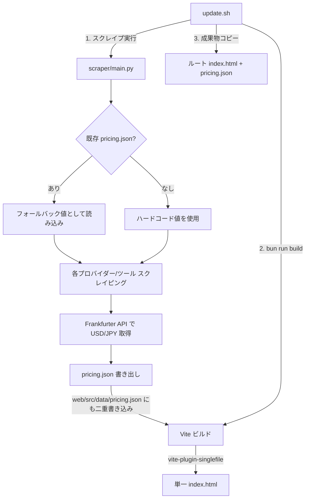

# Architecture

> AI エージェント向けアーキテクチャリファレンス。
> コードベースの全体構造・データフロー・依存関係・設計制約を網羅する。

## システム概要

AI モデルの時間別コスト計算機。2 つの独立したサブシステム（Python スクレイパー + React フロントエンド）が `pricing.json` を介してデータ連携する。

```text
┌──────────────┐    pricing.json    ┌──────────────┐    index.html
│   scraper/   │ ────────────────►  │     web/     │ ──────────────► ユーザー
│  (Python)    │                    │   (React)    │   単一 HTML
└──────────────┘                    └──────────────┘
       ▲                                   ▲
       │                                   │
   update.sh ──── オーケストレーション ─────┘
```

## データフロー詳細



## ディレクトリ構造と責務

```text
/
├── scraper/                     # Python 3.12+ / uv
│   ├── pyproject.toml           # 依存: playwright, httpx, pydantic v2
│   └── src/scraper/
│       ├── __init__.py
│       ├── main.py              # CLI エントリポイント (argparse)
│       ├── models.py            # Pydantic スキーマ (PricingData, ApiModel, SubTool)
│       ├── exchange.py          # USD/JPY レート取得 (Frankfurter API)
│       ├── browser.py           # Playwright ヘッドレスブラウザ + 価格抽出ユーティリティ
│       ├── providers/           # API プロバイダー別スクレイパー
│       │   ├── __init__.py      # re-export: scrape_anthropic, scrape_openai, ...
│       │   ├── anthropic.py
│       │   ├── openai.py
│       │   ├── google.py
│       │   ├── aws.py
│       │   ├── deepseek.py
│       │   └── xai.py
│       └── tools/               # コーディングツール別スクレイパー
│           ├── __init__.py      # re-export: scrape_cursor, scrape_github_copilot, ...
│           ├── cursor.py
│           ├── github_copilot.py
│           ├── windsurf.py
│           ├── claude_code.py
│           ├── jetbrains.py
│           ├── openai_codex.py
│           ├── google_one.py
│           └── antigravity.py
│
├── web/                         # React 19 + TypeScript + Vite 7 / bun
│   ├── package.json             # 依存: react, vite-plugin-singlefile
│   ├── vite.config.ts           # singlefile + assetsInlineLimit: 100M
│   ├── tsconfig.app.json        # strict, erasableSyntaxOnly (enum/namespace 禁止)
│   └── src/
│       ├── main.tsx             # ReactDOM.createRoot エントリ
│       ├── App.tsx              # ルートコンポーネント (タブ切替・シナリオ選択)
│       ├── App.test.tsx         # vitest + testing-library テスト
│       ├── setupTests.ts        # jest-dom マッチャー拡張
│       ├── i18n.ts              # JA/EN 翻訳定義
│       ├── types/
│       │   └── pricing.ts       # pricing.json の TypeScript 型定義
│       ├── lib/
│       │   └── cost.ts          # コスト計算ロジック (calcApiCost, calcSubCost, colorIndex, fmtUSD, fmtJPY)
│       ├── data/
│       │   └── pricing.json     # ビルド時に静的インポートされる価格データ
│       └── components/
│           ├── Hero.tsx          # ヒーローセクション
│           ├── LanguageToggle.tsx # JA/EN 切替
│           ├── ScenarioSelector.tsx # トークン使用量シナリオ選択
│           ├── ApiTable.tsx      # API モデル価格テーブル
│           ├── SubTable.tsx      # サブスクリプション価格テーブル
│           ├── DualCell.tsx      # USD + JPY デュアル表示セル
│           ├── MathSection.tsx   # 計算式解説セクション
│           └── RefLinks.tsx      # 参照リンク集
│
├── update.sh                    # オーケストレーター (scrape → build → copy)
├── netlify.toml                 # Netlify デプロイ設定 (ビルドのみ、スクレイプなし)
├── index.html                   # ビルド成果物 (単一ポータブル HTML)
├── pricing.json                 # ルートの価格データコピー
├── common-header.js             # 静的 HTML 用共通ヘッダー注入スクリプト (ドロップダウンナビゲーション)
├── common-header.css            # 共通ヘッダースタイル
├── claude/                      # Claude ドキュメント (skill.html / agent.html)
├── gemini/                      # Gemini ドキュメント (skill.html / agent.html)
├── codex/                       # Codex ドキュメント (skill.html / agent.html)
├── copilot/                     # Copilot ドキュメント (skill.html / agent.html)
├── CLAUDE.md                    # Claude Code 向けプロジェクト指示書
└── AGENTS.md                    # AI エージェント向けガイドライン
```

## コアデータモデル

### pricing.json スキーマ

```text
PricingData
├── generated_at: string          # ISO 8601 (UTC)
├── jpy_rate: float               # 1 USD = X JPY
├── jpy_rate_date: string         # "YYYY-MM-DD" | "fallback"
├── api_models: ApiModel[]
│   ├── provider: string          # "Anthropic" | "OpenAI" | "Google" | ...
│   ├── name: string              # "Claude Opus 4.6" | "GPT-4o" | ...
│   ├── tag: string               # UI 表示用タグ
│   ├── cls: string               # CSS クラス名
│   ├── price_in: float           # USD / 1M input tokens
│   ├── price_out: float          # USD / 1M output tokens
│   ├── sub_ja: string            # 日本語サブテキスト
│   ├── sub_en: string            # 英語サブテキスト
│   └── scrape_status: "success" | "fallback" | "manual"
└── sub_tools: SubTool[]
    ├── group: string             # "Cursor" | "GitHub Copilot" | ...
    ├── name: string              # プラン名
    ├── monthly: float            # 月額 (USD)
    ├── annual: float | null      # 年払い月換算 (USD) | null
    ├── tag / cls: string         # UI 表示用
    ├── note_ja / note_en: string # 備考テキスト
    └── scrape_status: "success" | "fallback" | "manual"
```

**型の同期ポイント:**

- Python 側: `scraper/src/scraper/models.py` (Pydantic v2)
- TypeScript 側: `web/src/types/pricing.ts`
- **片方を変更したら必ずもう片方も更新すること**

## 3 層フォールバック戦略

スクレイパーの価格決定は 3 段階:

```text
1. スクレイプ成功値        ← Playwright でページ取得 + 正規表現抽出
   ↓ 失敗
2. 既存 pricing.json の値  ← 前回実行時の結果を再利用
   ↓ なし
3. ハードコード値          ← 各スクレイパーの _FALLBACKS 辞書
```

各値には `scrape_status` フィールドが付与される:

- `"success"`: スクレイプ成功
- `"fallback"`: 既存値またはハードコード値を使用
- `"manual"`: 手動設定値

## スクレイパーの共通パターン

各プロバイダー/ツールスクレイパーは同じ構造を持つ:

```python
# providers/<name>.py または tools/<name>.py

_URL = "https://..."                          # スクレイプ対象 URL
_FALLBACKS: dict[str, tuple[float, float]] = { ... }  # ハードコード値

def scrape(existing: list[ApiModel] | None = None) -> list[ApiModel]:
    # 1. existing から fallback_map を構築
    # 2. get_page_text() でページ HTML 取得
    # 3. extract_price() + sanity_check() で価格抽出
    # 4. ApiModel / SubTool リストを返却
```

**browser.py のユーティリティ:**

- `get_page_text(url)`: Playwright ヘッドレスで JS レンダリング済みテキスト取得
- `extract_price(text, patterns)`: 正規表現リストで最初にマッチした価格を返す
- `sanity_check(value, name, fallback)`: 値の有効範囲チェック (0.001 - 2000 USD)

## フロントエンドアーキテクチャ

### コンポーネントツリー

```text
App
├── LanguageToggle         # JA/EN 切り替え
├── Hero                   # タイトル・統計情報
├── ScenarioSelector       # トークン量プリセット (light/standard/heavy/custom)
├── [tab=api] ApiTable     # API モデル料金テーブル (7 期間 × N モデル)
│   └── DualCell           # USD + JPY 二行表示セル
├── [tab=sub] SubTable     # サブスクリプションテーブル
│   └── DualCell
├── MathSection            # 計算式の解説
└── RefLinks               # 各社料金ページへのリンク
```

### 状態管理

React `useState` のみ使用（外部状態管理ライブラリなし）:

- `lang`: `'ja'` | `'en'`
- `tab`: `'api'` | `'sub'`
- `scenario`: シナリオキー
- `inputTokens` / `outputTokens`: トークン数

### コスト計算 (`lib/cost.ts`)

```text
API コスト (USD):
  (inputTokens / 1M * price_in + outputTokens / 1M * price_out) * hours

サブスク按分コスト (USD):
  hours <= 720   → monthly * hours / 720   (時間按分)
  hours >= 8760  → annual ?? monthly * 12  (年払い優先)
  else           → monthly * (hours / 720) (月数換算)
```

**期間定義** (`PERIODS`):

| キー   | 時間   |
| ------ | ------ |
| 1h     | 1      |
| 8h     | 8      |
| 24h    | 24     |
| 7d     | 168    |
| 30d    | 720    |
| 4mo    | 2920   |
| 12mo   | 8760   |

### ビルド出力

`vite-plugin-singlefile` により全 CSS/JS がインライン化され、**単一の `index.html`** が出力される。

- `assetsInlineLimit: 100_000_000` (100MB) で強制インライン
- `cssCodeSplit: false` + `inlineDynamicImports: true`
- 外部依存なし、オフラインで動作可能

## 外部 API 依存

| API             | 用途           | 認証        | フォールバック      |
|-----------------|----------------|-------------|---------------------|
| Frankfurter API | USD/JPY レート | 不要 (公開) | 既存値 or 155.0     |
| 各社料金ページ  | 価格スクレイプ | 不要 (公開) | 3 層フォールバック  |

## CI/CD

### GitHub Actions (`.github/workflows/test.yaml`)

```text
changes (パスフィルター)
├── web/** 変更時  → web-test  (bun install → bun test)
└── scraper/** 変更時 → scraper-test (uv sync → pytest)
```

- `dorny/paths-filter@v3` で変更検出、無関係なジョブをスキップ
- web-test は `bun test || true`（テスト失敗を CI ブロックにしない）
- scraper-test は `uv run pytest`（strict）

### Netlify デプロイ

- `netlify.toml`: `cd web && bun install && bun run build` のみ実行
- スクレイパーは Netlify 上では**走らない**（リポジトリの既存 `pricing.json` を使用）
- 公開ディレクトリ: `.` (ルート)

## 新規プロバイダー/ツール追加手順

1. `scraper/src/scraper/providers/<name>.py` (API) または `tools/<name>.py` (ツール) を作成
2. `_FALLBACKS` 辞書にハードコードフォールバック値を定義
3. `scrape(existing)` 関数を実装 → `list[ApiModel]` または `list[SubTool]` を返す
4. `providers/__init__.py` または `tools/__init__.py` にインポートと `__all__` を追加
5. `scraper/src/scraper/main.py` の `_scrape_all()` にエントリ追加

## 設計制約・注意事項

- **enum / namespace 禁止**: `erasableSyntaxOnly: true` (TypeScript 5.5+)
- **型の同期必須**: `models.py` と `pricing.ts` は常に一致させる
- **二重書き込み**: スクレイパーは `--output` 先と `web/src/data/pricing.json` の両方に書く
- **単一 HTML 制約**: 外部アセット参照不可、全てインライン
- **i18n 方式**: `i18n.ts` のオブジェクトで `[lang]` アクセス。フレームワークなし
- **状態管理**: useState のみ。Redux 等の導入は禁止
