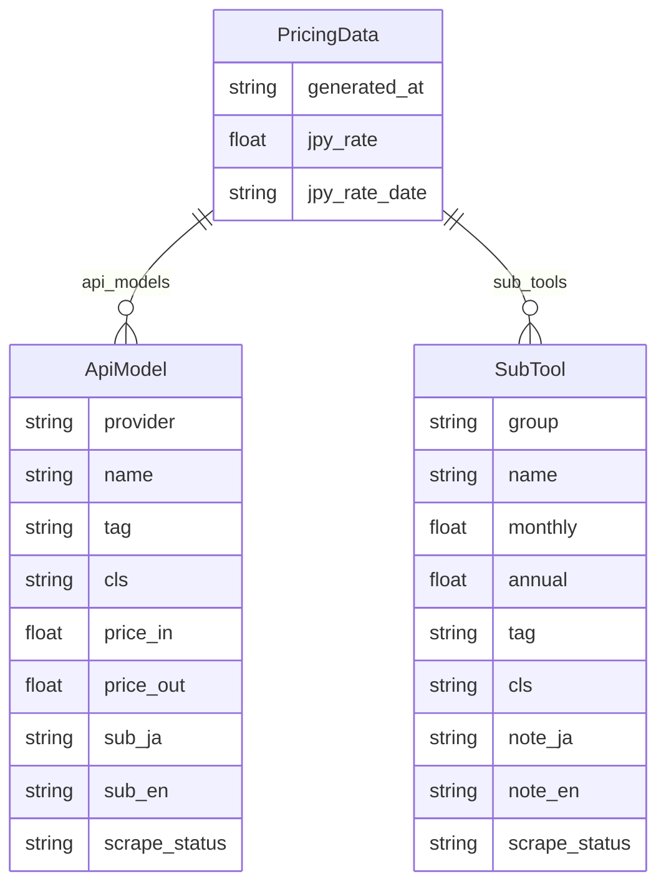
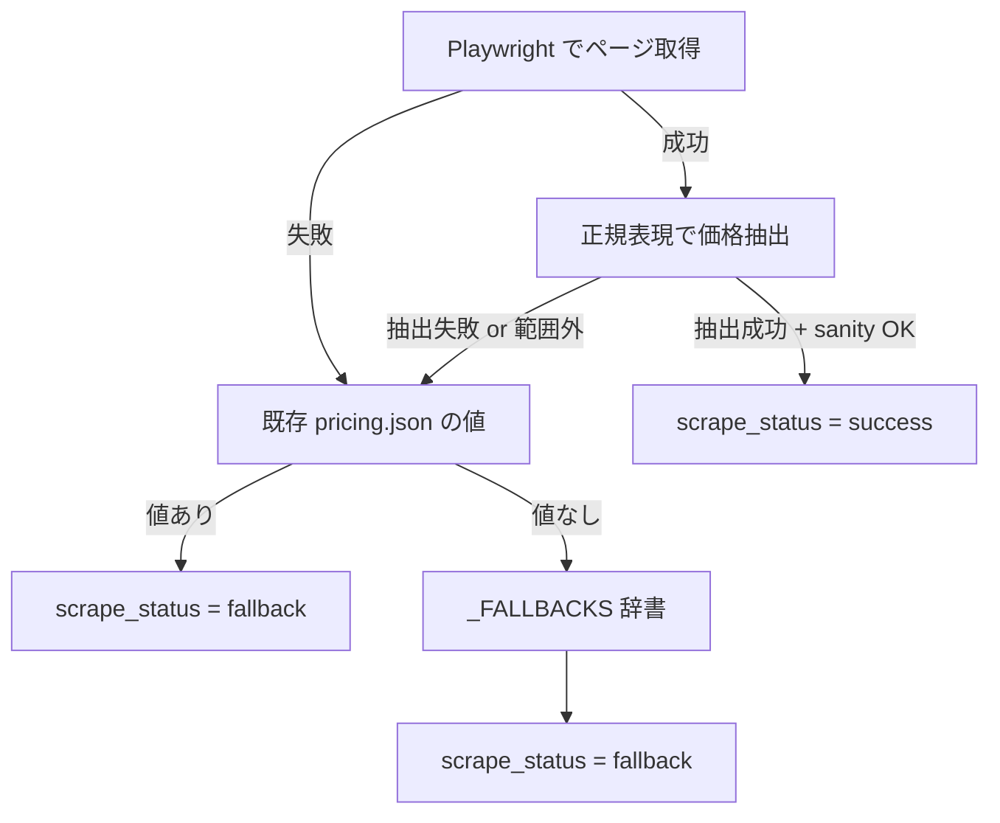
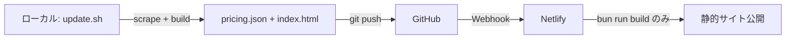

# design.md — 技術設計ドキュメント

> **目的**: アーキテクチャの設計判断とその根拠を記録する。ARCHITECTURE.md が「構造の事実」を記述するのに対し、本文書は「なぜその構造にしたか」を記述する。
> **最終更新**: 2026-02-28

---

## 1. 設計原則

| 原則 | 説明 | 適用例 |
| ------ | ------ | -------- |
| **Single File Distribution** | 単一 HTML で完結する配布形態 | vite-plugin-singlefile |
| **Graceful Degradation** | データ取得失敗時も動作を継続 | 3 層フォールバック |
| **Type Safety Bridge** | 異なる言語間で型を同期 | models.py ↔ pricing.ts |
| **DOM-only Rendering** | innerHTML 不使用で XSS を根本排除 | common-header.js |
| **Minimal State** | 外部状態管理なし、useState のみ | App.tsx |

---

## 2. データアーキテクチャ

### 2.1 pricing.json スキーマ設計



**設計判断**:

- `scrape_status` を各モデル/ツールに付与 → データの信頼性をユーザーに透過的に伝達可能
- `sub_ja`/`sub_en` をデータ層に持つ → フロントエンドの i18n 辞書とスクレイパーの責務を分離
- `annual` を nullable → 年払い非対応プランを明示的に表現

### 2.2 型同期戦略

```text
scraper/src/scraper/models.py (Pydantic v2)
        ↕ 手動同期（自動生成なし）
web/src/types/pricing.ts (TypeScript interface)
```

**なぜ自動生成しないか**:

- Pydantic → TypeScript の自動変換ツールは不安定（バリデーションロジックの差異）
- フィールド数が少なく（9 + 9）、手動同期のコストが低い
- `erasableSyntaxOnly` 制約下では enum 変換が不可能
- **リスク軽減**: CLAUDE.md に「片方を変更したら必ずもう片方も更新すること」を明記

---

## 3. スクレイパー設計

### 3.1 3 層フォールバック



**なぜ 3 層か**:

- レイヤー 1（スクレイプ）: 最新データだが外部サイト依存で不安定
- レイヤー 2（既存 JSON）: 前回成功時のデータを再利用し、一時的な障害を吸収
- レイヤー 3（ハードコード）: 初回実行や長期障害時のセーフティネット
- `manual` ステータスは手動で pricing.json を編集した場合に使用

### 3.2 スクレイパー共通パターン

全プロバイダー/ツールスクレイパーが従う統一インターフェース:

```python
# providers/<name>.py
_URL = "https://..."
_FALLBACKS: dict[str, tuple[float, float]] = { ... }

def scrape(existing: list[ApiModel] | None = None) -> list[ApiModel]:
    ...
```

**設計判断**:

- `existing` パラメータで前回データを受け取り → フォールバック値構築に使用
- 各スクレイパーは独立モジュール → 新プロバイダー追加時の影響範囲を最小化
- `_FALLBACKS` をモジュールレベル定数に → テスト時にモック不要でハードコード値を検証可能

### 3.3 sanity check 設計

```python
def sanity_check(value, name, fallback, low=0.001, high=2000.0):
    """値が有効範囲内ならそのまま返し、範囲外なら fallback を返す"""
```

**なぜ 0.001〜2000 USD か**:

- 下限 0.001: 最安モデル（GPT-5 Nano $0.05）の 1/50 まで許容
- 上限 2000: 最高額モデル（GPT-5.2 pro $168.00）の 10 倍まで許容
- HTML 構造変更で「$35.0」のような誤抽出を検出するための安全弁

---

## 4. フロントエンド設計

### 4.1 状態管理

```text
App (useState)
├── lang: 'ja' | 'en'
├── tab: 'api' | 'sub'
├── scenario: ScenarioKey
├── inputTokens: number
└── outputTokens: number
```

**なぜ useState のみか**:

- 状態が 5 つしかなく、全て App コンポーネントで完結
- Props drilling の深さは最大 2 階層（App → Table → Cell）
- Redux / Zustand 等の導入は複雑性に対してオーバーキル

### 4.2 コスト計算ロジック

```typescript
// API コスト（USD）
calcApiCost(priceIn, priceOut, input, output, hours) =
  (input / 1_000_000 * priceIn + output / 1_000_000 * priceOut) * hours

// サブスク按分コスト（USD）
calcSubCost(monthly, annual, hours) =
  hours <= 720   ? monthly * hours / 720          // 時間按分
  hours >= 8760  ? annual ?? monthly * 12          // 年払い優先
                 : monthly * (hours / 720)          // 月数換算
```

**設計判断**:

- 全計算を純粋関数に → テスト容易性を最大化
- 浮動小数点誤差は表示時に `toFixed(2)` で丸め → 計算中間値では丸めない

### 4.3 単一 HTML ビルド

```text
Vite Build Pipeline:
  src/ → TypeScript コンパイル → バンドル → vite-plugin-singlefile → index.html
                                                   ↓
                                        CSS/JS 全てインライン
                                        pricing.json も埋め込み
```

**なぜ単一 HTML か**:

- USB メモリやメール添付で配布可能
- 社内ネットワーク制限環境でも動作
- CDN 障害の影響を受けない
- **トレードオフ**: ファイルサイズが大きくなる（現在 ~500KB）

---

## 5. 共通ヘッダー設計

### 5.1 注入方式

```text
<body>
  ├── <nav class="ch-nav">          ← common-header.js が動的生成
  │   └── <div class="ch-container">
  │       ├── <a class="ch-brand">
  │       ├── <button class="ch-hamburger">
  │       └── <ul class="ch-links">
  │           ├── <li><a>Home</a></li>
  │           ├── <li class="ch-dropdown">
  │           │   ├── <button class="ch-dropdown-toggle">
  │           │   └── <ul class="ch-submenu">
  │           └── <li><a>GitHub ↗</a></li>
  ├── <div class="ch-disclaimer">   ← 免責事項バナー
  │   ├── <span class="ch-disclaimer-line">行1</span>
  │   └── <span class="ch-disclaimer-line">行2</span>
  └── (ページ固有コンテンツ)
```

**設計判断**:

- IIFE（即時実行関数）で名前空間を汚染しない
- `document.currentScript` を async 前にキャプチャ → `await` 後は null になるため
- `nav-links.json` → `data-links` 属性 → デフォルト値の 3 段階で設定を外部化
- href の安全性検証（`isSafeHref`）でプロトコルインジェクションを防止

### 5.2 免責事項バナーの高さ追従

```javascript
// ResizeObserver で高さ変化を監視
const ro = new ResizeObserver(() => {
  const h = disclaimer.getBoundingClientRect().height;
  document.documentElement.style.setProperty('--ch-disclaimer-height', h + 'px');
});
ro.observe(disclaimer);
```

**なぜ ResizeObserver か**:

- `requestAnimationFrame` は 1 回限りで、フォントロード後の再計算に対応できない
- `window.resize` はビューポート変更のみで、コンテンツ変化を検知できない
- ResizeObserver は要素自体のサイズ変化を監視 → フォントロード、テキスト変更にも対応
- 非対応ブラウザ向けフォールバック（rAF + resize イベント）を提供

### 5.3 レスポンシブ戦略

| ブレークポイント | ナビゲーション | 免責事項 |
| ----------------- | --------------- | ---------- |
| >768px | 横並びリンク + hover ドロップダウン | 2 行分割表示（0.75rem） |
| ≤768px | ハンバーガー + アコーディオン | 縮小（0.7rem） |
| ≤480px | 同上 | さらに縮小（0.65rem）、自然折り返し |

---

## 6. デプロイ設計



**なぜスクレイパーを Netlify で実行しないか**:

- Playwright ブラウザのインストールが必要（ビルド時間 + 容量制約）
- スクレイプ対象サイトの IP ブロックリスク
- ビルド時間の予測不能性（外部サイト応答時間に依存）
- **代替案**: GitHub Actions でスクレイプ → auto-commit（将来検討）

---

## 7. AI エージェント統合設計

### 7.1 CLAUDE.md による指示体系

```text
~/.claude/CLAUDE.md          ← グローバル設定（言語、スタイル、セキュリティ）
  └── /CLAUDE.md             ← プロジェクト設定（アーキテクチャ、禁止事項、コマンド）
      └── CLAUDE.local.md    ← 個人設定（.gitignore 対象）
```

**設計参考**: claude/skill.html の SDD 方法論

### 7.2 サブエージェント設計パターン

claude/agent.html に基づく推奨パターン:

| パターン | 用途 | モデル |
| ---------- | ------ | -------- |
| Explore | コードベース探索 | haiku（高速・低コスト） |
| Plan | 実装計画策定 | inherit（親と同じ） |
| Code Reviewer | コードレビュー | sonnet（バランス） |
| Debugger | バグ修正 | inherit |

**ルーティング判断基準**:

```text
タスク 3 件以上？ → NO → メインエージェント
                → YES → 依存関係あり？ → YES → 順次実行
                                      → NO → 共有状態あり？ → YES → 順次実行
                                                             → NO → 並列実行
```

### 7.3 AGENTS.md によるクロスツール互換

gemini/agent.html に基づく設計:

| ツール | 読み込みファイル |
| -------- | ---------------- |
| Claude Code | CLAUDE.md → AGENTS.md |
| Gemini CLI | GEMINI.md → AGENTS.md |
| Cursor | .cursorrules → AGENTS.md |

AGENTS.md を共通エントリポイントとし、ツール固有の設定は各 `.md` に分離。

---

## 8. 参考資料

### 8.1 SDD 関連

- [Anthropic Sub-agents](https://code.claude.com/docs/en/sub-agents) — サブエージェント設定仕様
- [Anthropic Agent Teams](https://code.claude.com/docs/en/agent-teams) — Agent Teams 実験的機能
- [Anthropic Skills](https://code.claude.com/docs/en/skills) — スキル定義仕様

### 8.2 Gemini 関連

- [ADK Multi-agent](https://google.github.io/adk-docs/agents/multi-agents/) — SequentialAgent / ParallelAgent / LoopAgent
- [A2A Protocol](https://google.github.io/adk-docs/a2a/) — エージェント間通信プロトコル
- [Gemini CLI Docs](https://google-gemini.github.io/gemini-cli/docs/) — GEMINI.md 階層ロード仕様

### 8.3 プロジェクト内部

- `docs/ARCHITECTURE.md` — 構造の事実を記述
- `docs/TESTING.md` — テスト戦略
- `docs/requirements.md` — 要件定義
- `docs/tasks.md` — 実装ロードマップ
